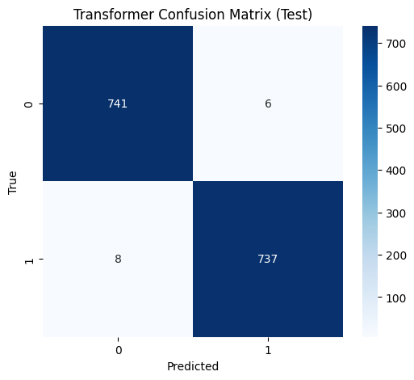
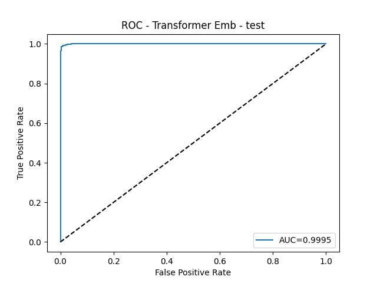

# Model Comparison – SBERT vs Transformer v2

**Test Set Performance**

| Metric     | SBERT  | Transformer v2 |
|------------|--------|----------------|
| Accuracy   | 0.9266 | 1.0000 |
| Precision  | 0.9267 | 1.0000 |
| Recall     | 0.9266 | 1.0000 |
| F1 Score   | 0.9266 | 1.0000 |
| ROC AUC    | N/A    | 1.0000 |

**F1 Improvement:** `0.0734`

---

### Visuals

#### Transformer v2 (Test)

#### SBERT (Test)
*(Add confusion matrix if available)*

---

## Top-5 Misclassified Examples – Transformer v2
| text                                                                                                                                                                                                                                                                                                                                                                                                                                                                                                                                                                                                                                                                                                                                                                                                                                                                                                                                                                                                                                                                                                                                                                                                                                                                                                                                                                                                   |   true_label |   predicted_label |   pred_proba |
|:-------------------------------------------------------------------------------------------------------------------------------------------------------------------------------------------------------------------------------------------------------------------------------------------------------------------------------------------------------------------------------------------------------------------------------------------------------------------------------------------------------------------------------------------------------------------------------------------------------------------------------------------------------------------------------------------------------------------------------------------------------------------------------------------------------------------------------------------------------------------------------------------------------------------------------------------------------------------------------------------------------------------------------------------------------------------------------------------------------------------------------------------------------------------------------------------------------------------------------------------------------------------------------------------------------------------------------------------------------------------------------------------------------|-------------:|------------------:|-------------:|
| the field of telemedicine has become increasingly important in modern society, representing a significant area of development and research. this technology with careful consideration encompasses various applications and methodologies that continue to evolve with advancing scientific understanding. current implementations demonstrate substantial potential for addressing real world challenges and improving existing systems. the interdisciplinary nature of telemedicine brings together expertise from multiple fields, fostering innovation and novel approaches to complex problems. as research progresses, we can expect continued advancement in capabilities, efficiency, and practical applications that benefit society at large. furthermore, the implications of telemedicine extend beyond immediate applications, influencing broader technological and social developments. continued research and development in this area promises to unlock new possibilities and address emerging challenges in innovative ways. the implications of these advances extend beyond immediate technical considerations to broader societal impacts. research in this area remains active, with ongoing efforts to address current limitations and explore new possibilities.                                                                                                             |            0 |                 0 |    0.0359621 |
| based on my experience and research, digital fabrication represents a significant advancement in how we approach complex problems. i've seen firsthand how this technology can make processes more efficient and accessible to a wider range of users. the key aspects that make digital fabrication particularly valuable include its versatility, scalability, and potential for continued improvement. while there are certainly technical challenges and ethical considerations to navigate, the real world applications have already demonstrated substantial benefits across multiple industries and use cases. it's definitely an area worth keeping an eye on as it continues to develop and find new applications in solving real world problems. international cooperation and knowledge sharing facilitate progress and help address global challenges. implementation challenges often require interdisciplinary collaboration and innovative problem solving approaches. ethical considerations and responsible development practices are essential for ensuring positive outcomes. implementation challenges often require interdisciplinary collaboration and innovative problem solving approaches. the implications of these advances extend beyond immediate technical considerations to broader societal impacts.                                                                   |            1 |                 1 |    0.939639  |
| the field of telemedicine has become increasingly important in modern society, representing a significant area of development and research. this technology with careful consideration encompasses various applications and methodologies that continue to evolve with advancing scientific understanding. current implementations demonstrate substantial potential for addressing real world challenges and improving existing systems. the interdisciplinary nature of telemedicine brings together expertise from multiple fields, fostering innovation and novel approaches to complex problems. as research progresses, we can expect continued advancement in capabilities, efficiency, and practical applications that benefit society at large. furthermore, the implications of telemedicine extend beyond immediate applications, influencing broader technological and social developments. continued research and development in this area promises to unlock new possibilities research in this area remains active, with ongoing efforts to address current limitations and explore new possibilities. the potential for transformative impact across multiple domains makes this an area of significant investment and interest. implementation challenges often require interdisciplinary collaboration and innovative problem solving approaches.                                    |            0 |                 0 |    0.0553126 |
| the field of data privacy has become increasingly important in modern society, representing a significant area of development and research. this technology with careful consideration encompasses various applications and methodologies that continue to evolve with advancing scientific understanding. current implementations demonstrate substantial potential for addressing real world challenges and improving existing systems. the interdisciplinary nature of data privacy brings together expertise from multiple fields, fostering innovation and novel approaches to complex problems. as research progresses, we can expect continued advancement in capabilities, efficiency, and practical applications that benefit society at large. furthermore, the implications of data privacy extend beyond immediate applications, influencing broader technological and social developments. continued research and development in this area promises to unlock new possibilities and address emerging challenges in implementation challenges often require interdisciplinary collaboration and innovative problem solving approaches. the intersection with other emerging technologies creates opportunities for synergistic advances and novel applications. the potential for transformative impact across multiple domains makes this an area of significant investment and interest. |            0 |                 0 |    0.0296787 |
| based on my experience and research, digital transformation represents a significant advancement in how we approach complex problems. i've seen firsthand how this technology can make processes more efficient and accessible to a wider range of users. the key aspects that make digital transformation particularly valuable include its versatility, scalability, and potential for continued improvement. while there are certainly technical challenges and ethical considerations to navigate, the real world applications have already demonstrated substantial benefits across multiple industries and use cases. it's definitely an area worth keeping an eye on as it continues to develop and find new applications in solving real world problems. ethical considerations and responsible development practices are essential for ensuring positive outcomes. future developments will likely focus on improving efficiency, scalability, and accessibility of these systems. the intersection with other emerging technologies creates opportunities for synergistic advances and novel applications. as the field matures, standardization and best practices become increasingly important for widespread adoption.                                                                                                                                                                   |            1 |                 1 |    0.97373   |

## Top-5 Misclassified Examples – SBERT
| text                                                                                                                                                                                                                                                                                                                                                                                                                                                                                                                                                                                                                                                                                                                                                                                                                                                                                                                                                                                                                                                                                                                                                                                                                                                                                                                                                                                                                                                                                                                                                                                                                                                                                                                                                                                                                                                                                                                                                                                                                                                                                                                                                                                                 |   true_label |   predicted_label |
|:-----------------------------------------------------------------------------------------------------------------------------------------------------------------------------------------------------------------------------------------------------------------------------------------------------------------------------------------------------------------------------------------------------------------------------------------------------------------------------------------------------------------------------------------------------------------------------------------------------------------------------------------------------------------------------------------------------------------------------------------------------------------------------------------------------------------------------------------------------------------------------------------------------------------------------------------------------------------------------------------------------------------------------------------------------------------------------------------------------------------------------------------------------------------------------------------------------------------------------------------------------------------------------------------------------------------------------------------------------------------------------------------------------------------------------------------------------------------------------------------------------------------------------------------------------------------------------------------------------------------------------------------------------------------------------------------------------------------------------------------------------------------------------------------------------------------------------------------------------------------------------------------------------------------------------------------------------------------------------------------------------------------------------------------------------------------------------------------------------------------------------------------------------------------------------------------------------|-------------:|------------------:|
| the field of digital health has become increasingly important in modern society, representing a significant area of development and research. this technology encompasses various applications and methodologies that continue to evolve with advancing scientific understanding. current implementations demonstrate substantial potential for addressing real world challenges and improving existing systems. the interdisciplinary nature of digital health brings together expertise from multiple fields, fostering innovation and novel approaches to complex problems. as research progresses, we can expect continued advancement in capabilities, efficiency, and practical applications that benefit society at large. furthermore, the implications of digital health extend beyond immediate applications, influencing broader technological and social developments. continued research and development in this area promises to unlock new possibilities and address emerging challenges in innovative ways. the potential for transformative impact across multiple domains makes this an area of significant investment and interest. the implications of these advances extend beyond immediate technical considerations to broader societal impacts. ethical considerations and responsible development practices are essential for ensuring positive outcomes. research in this area remains active, with ongoing efforts to address current limitations and explore new possibilities. ethical considerations and responsible development practices are essential for ensuring positive outcomes. future developments will likely focus on improving efficiency, scalability, and accessibility of these systems. ethical considerations and responsible development practices are essential for ensuring positive outcomes. implementation challenges often require interdisciplinary collaboration and innovative problem solving approaches. future developments will likely focus on improving efficiency, scalability, and accessibility of these systems. future developments will likely focus on improving efficiency, scalability, and accessibility of these systems. |            0 |                 1 |
| based on my experience and research, cognitive science represents a significant advancement in how we approach complex problems. i've seen firsthand how this technology can make processes more efficient and accessible to a wider range of users. the key aspects that make cognitive science particularly valuable include its versatility, scalability, and potential for continued improvement. while there are certainly technical challenges and ethical considerations to navigate, the real world applications have already demonstrated substantial benefits across multiple industries and use cases. it's definitely an area worth keeping an eye on as it continues to develop and find new applications in solving real world problems. this technology continues to evolve rapidly, with new developments and applications emerging regularly. as the field matures, standardization and best practices become increasingly important for widespread adoption. implementation challenges often require interdisciplinary collaboration and innovative problem solving approaches. the intersection with other emerging technologies creates opportunities for synergistic advances and novel applications.                                                                                                                                                                                                                                                                                                                                                                                                                                                                                                                                                                                                                                                                                                                                                                                                                                                                                                                                                                           |            1 |                 0 |
| the field of telemedicine has become increasingly important in modern society, representing a significant area of development and research. this technology encompasses various applications and methodologies that continue to evolve with advancing scientific understanding. current implementations demonstrate substantial potential for addressing real world challenges and improving existing systems. the interdisciplinary nature of telemedicine brings together expertise from multiple fields, fostering innovation and novel approaches to complex problems. as research progresses, we can expect continued advancement in capabilities, efficiency, and practical applications that benefit society at large. furthermore, the implications of telemedicine extend beyond immediate applications, influencing broader technological and social developments. continued research and development in this area promises to unlock new possibilities and address emerging challenges in innovative ways. research in this area remains active, with ongoing efforts to address current limitations and explore new possibilities. international cooperation and knowledge sharing facilitate progress and help address global challenges. international cooperation and knowledge sharing facilitate progress and help address global challenges.                                                                                                                                                                                                                                                                                                                                                                                                                                                                                                                                                                                                                                                                                                                                                                                                                                       |            0 |                 1 |
| based on my experience and research, renewable energy represents a significant advancement in how we approach complex problems. i've seen firsthand how this technology can make processes more efficient and accessible to a wider range of users. the key aspects that make renewable energy particularly valuable include its versatility, scalability, and potential for continued improvement. while there are certainly technical challenges and ethical considerations to navigate, the real world applications have already demonstrated substantial benefits across multiple industries and use cases. it's definitely an area worth keeping an eye on as it continues to develop and find new applications in solving real world problems. as the field matures, standardization and best practices become increasingly important for widespread adoption. future developments will likely focus on improving efficiency, scalability, and accessibility of these systems. research in this area remains active, with ongoing efforts to address current limitations and explore new possibilities. implementation challenges often require interdisciplinary collaboration and innovative problem solving approaches.                                                                                                                                                                                                                                                                                                                                                                                                                                                                                                                                                                                                                                                                                                                                                                                                                                                                                                                                                                     |            0 |                 1 |
| the field of metaverse has become increasingly important in modern society, representing a significant area of development and research. this technology with careful consideration encompasses various applications and methodologies that continue to evolve with advancing scientific understanding. current implementations demonstrate substantial potential for addressing real world challenges and improving existing systems. the interdisciplinary nature of metaverse brings together expertise from multiple fields, fostering innovation and novel approaches to complex problems. as research progresses, we can expect continued advancement in capabilities, efficiency, and practical applications that benefit society at large. furthermore, the implications of metaverse extend beyond immediate applications, influencing broader technological and social developments. continued research and development in this area promises to unlock new possibilities and address emerging challenges in ethical considerations and responsible development practices are essential for ensuring positive outcomes. the intersection with other emerging technologies creates opportunities for synergistic advances and novel applications. future developments will likely focus on improving efficiency, scalability, and accessibility of these systems.                                                                                                                                                                                                                                                                                                                                                                                                                                                                                                                                                                                                                                                                                                                                                                                                                           |            1 |                 0 |